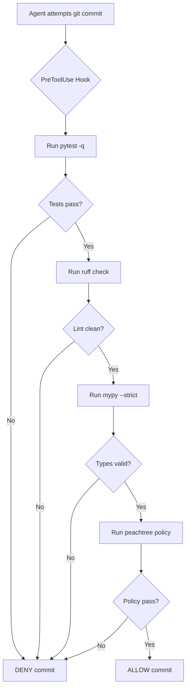

# Pre-Commit Quality Check Hook

**File**: `.github/hooks/pre-commit-quality-check.json`  
**Event**: `PreToolUse`  
**Trigger**: Before `git commit` operations  
**Purpose**: Enforce quality gates automatically before any code is committed

## What This Hook Does

This hook intercepts `git commit` commands and runs the complete PeachTree quality gate checklist:

1. **Test Suite**: `pytest -q` - All 129+ tests must pass
2. **Linting**: `ruff check src/ tests/` - Zero violations required
3. **Type Checking**: `mypy src/peachtree/ --strict` - Zero type errors
4. **Policy Compliance**: `peachtree policy` - Safety gates must pass

If **any check fails**, the commit is **blocked** with an error message.

## How It Works



## Configuration

**Timeout**: 120 seconds (2 minutes)  
**Blocking**: Yes - exits with code 2 to block commit on failure  
**Scope**: Workspace (applies to all team members)

## Example Output

### ✅ Success (All Gates Pass)
```
[PeachTree] Running pre-commit quality checks...
============================= test session starts ==============================
129 passed in 2.45s
All checks passed!
✓ Commit allowed
```

### ❌ Failure (Quality Gate Failed)
```
[PeachTree] Running pre-commit quality checks...
============================= test session starts ==============================
FAILED tests/test_hancock_integration.py::test_discover_sources - AssertionError
=========================== 1 failed, 128 passed in 2.89s ===========================

❌ Quality gates failed. All checks must pass before commit:
   pytest -q && ruff check && mypy --strict && peachtree policy

🚫 Commit DENIED
```

## When Hook Runs

The hook only triggers for these specific commands:
- `git commit`
- `git commit -m "message"`
- `git commit --amend`
- `git commit -a`
- Any variation of git commit

**Does NOT trigger for:**
- File edits
- Git add/status/push operations
- Non-commit terminal commands
- Tool operations other than run_in_terminal

## Quality Gate Requirements

### 1. Test Suite (`pytest -q`)
- **Requirement**: All 129+ tests pass
- **Command**: `pytest tests/ -v` (verbose for local testing)
- **Why**: Ensures no regressions in dataset pipelines, safety gates, or core functionality

### 2. Linting (`ruff check`)
- **Requirement**: Zero violations
- **Auto-fix**: `ruff check --fix src/ tests/`
- **Config**: Line length 100, Python 3.10+ target
- **Why**: Maintains consistent code style and catches common errors

### 3. Type Checking (`mypy --strict`)
- **Requirement**: Zero type errors
- **Strict mode**: All parameters and returns must be typed
- **Syntax**: Modern hints (`str | None` not `Optional[str]`)
- **Why**: Prevents type-related bugs in frozen dataclasses and JSONL operations

### 4. Policy Compliance (`peachtree policy`)
- **Requirement**: Safety policy passes
- **Checks**: License compliance, secret filtering, provenance tracking
- **Why**: Ensures datasets meet safety-first principles

## Bypassing the Hook (NOT RECOMMENDED)

**You should NOT bypass this hook.** The quality gates exist to prevent broken code from entering the codebase.

If you absolutely must bypass (emergency only):
- The hook is workspace-level and cannot be easily bypassed
- Attempting `git commit --no-verify` will be caught by the safety-validation.json hook
- Contact repository maintainers for emergency procedures

## Troubleshooting

### Hook Not Running
```bash
# Verify hook file exists
ls -la .github/hooks/pre-commit-quality-check.json

# Check JSON syntax
jq . .github/hooks/pre-commit-quality-check.json
```

### Tests Failing
```bash
# Run verbose tests to see failures
pytest tests/ -v --tb=short

# Run specific test file
pytest tests/test_hancock_integration.py -v
```

### Linting Errors
```bash
# Auto-fix most issues
ruff check --fix src/ tests/

# Show remaining issues
ruff check src/ tests/
```

### Type Errors
```bash
# Run mypy to see errors
mypy src/peachtree/ --strict

# Common fixes:
# - Add type hints to function parameters
# - Use modern syntax: str | None instead of Optional[str]
# - Check frozen dataclass usage patterns
```

### Policy Failures
```bash
# Run policy check manually
peachtree policy

# Common issues:
# - Missing license information
# - Secret patterns detected
# - Provenance fields missing
```

## Performance

**Typical runtime**: 3-5 seconds for full quality check suite
- pytest: 1-2 seconds (quick mode)
- ruff: <1 second
- mypy: 1-2 seconds
- peachtree policy: <1 second

**Timeout**: 120 seconds (generous buffer for CI environments)

## Related Files

- `.github/hooks/safety-validation.json` - Prevents test-skipping attempts
- `.github/workflows/ci.yml` - Same checks run in CI pipeline
- `AGENTS.md` - Development guide with quality checklist
- `.github/skills/frozen-dataclass-patterns/` - Common error prevention
- `.github/skills/jsonl-operations/` - JSONL format guidance

## Maintenance

**Last Updated**: April 27, 2026  
**Owner**: PeachTree Development Team  
**Version**: 1.0.0

To update quality gate checks, modify the `command` field in the JSON file. Always test changes locally before committing.
