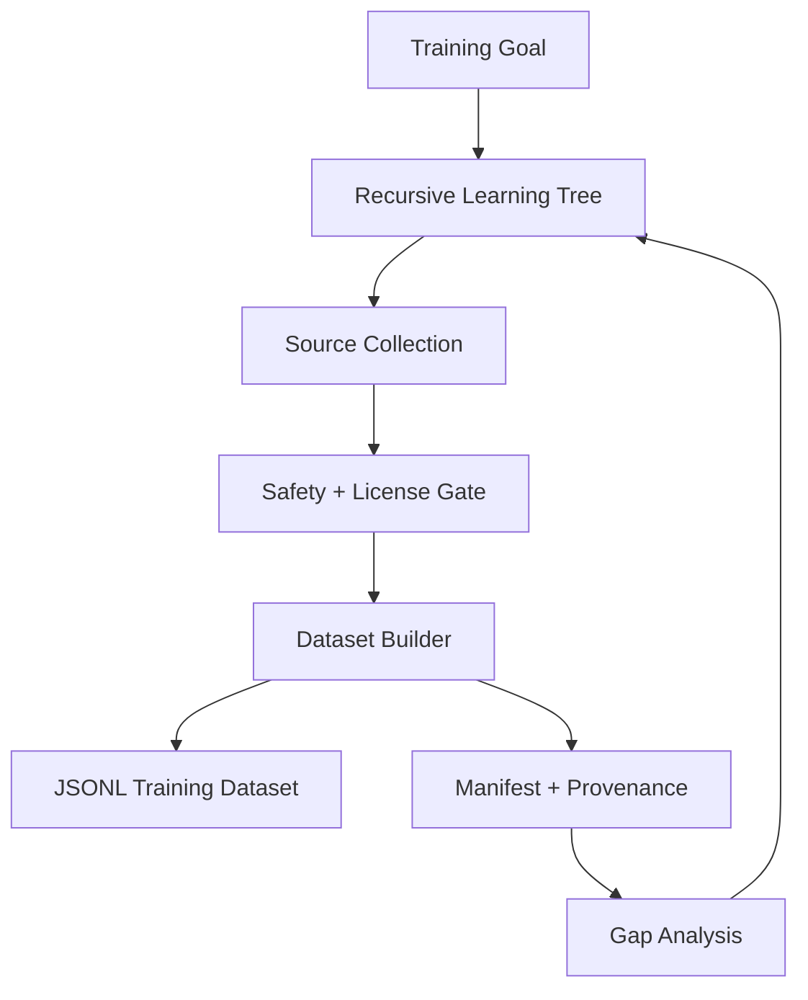

# PeachTree

**PeachTree** is the recursive learning-tree dataset engine for CyberViser / 0AI projects.

It is designed to become a shared dependency for Hancock, PeachFuzz/CactusFuzz, and future 0AI model-training pipelines.

## Mission

PeachTree turns repositories, docs, tests, fuzz reports, issue notes, and architecture plans into traceable, safe, deduplicated JSONL datasets for model training.



## Safety defaults

PeachTree does **not** blindly scrape GitHub.

- local/owned repository ingestion is enabled first
- public GitHub collection is disabled by default
- public collection requires explicit opt-in, license allowlists, rate limits, and provenance
- secret/token/private-key patterns are blocked
- provenance metadata is attached to every record
- generated datasets are ignored by default until reviewed

## Quick start

```bash
python3 -m venv ~/venvs/peachtree
source ~/venvs/peachtree/bin/activate
python -m pip install -e ".[dev]"

pytest -q

peachtree policy
peachtree plan --goal "Build PeachFuzz training data" --project peachfuzz
peachtree ingest-local --repo . --repo-name peachtree --output data/raw/peachtree.jsonl
peachtree build --source data/raw/peachtree.jsonl --dataset data/datasets/peachtree.jsonl --manifest data/manifests/peachtree.json --domain peachtree
peachtree audit --dataset data/datasets/peachtree.jsonl
```

## Create the GitHub repo

```bash
cd ~
unzip PeachTree-v0.1.0.zip
cd PeachTree-v0.1.0

git init
git branch -M main
git add .
git commit -m "feat: initial PeachTree recursive dataset engine"

gh repo create 0ai-Cyberviser/PeachTree --public --source=. --remote=origin --push
```

## Integrate with PeachFuzz

```bash
peachtree ingest-local --repo ~/peachfuzz --repo-name peachfuzz --output data/raw/peachfuzz.jsonl
peachtree build --source data/raw/peachfuzz.jsonl --dataset data/datasets/peachfuzz-instruct.jsonl --manifest data/manifests/peachfuzz.json --domain peachfuzz
```

## Integrate with Hancock

```bash
peachtree ingest-local --repo ~/Hancock --repo-name hancock --output data/raw/hancock.jsonl
peachtree build --source data/raw/hancock.jsonl --dataset data/datasets/hancock-instruct.jsonl --manifest data/manifests/hancock.json --domain hancock
```

## Roadmap

- v0.1.0: local recursive dataset engine
- v0.2.0: safe GitHub connector for owned repos
- v0.3.0: dependency graph across Hancock, PeachFuzz, PeachTree
- v0.4.0: model exporter profiles for ChatML, Alpaca, ShareGPT
- v0.5.0: CI scheduled dataset update PRs


## Owned GitHub connector

PeachTree v0.2.x adds a review-first owned GitHub connector.

```bash
peachtree github-owned --owner 0ai-Cyberviser --limit 25 --output data/manifests/owned.jsonl
peachtree github-plan --inventory data/manifests/owned.jsonl
bash scripts/clone_owned_repos.sh
bash scripts/build_owned_datasets.sh
```

The connector inventories access-authorized repositories and generates reviewable scripts. Public GitHub-wide collection remains disabled by default.


## Dependency graphs and lineage maps

PeachTree v0.3.0 adds local-only graph and lineage reports.

```bash
peachtree graph --inventory data/manifests/owned.jsonl --format mermaid --output reports/ecosystem-graph.mmd
peachtree lineage --dataset data/datasets/peachfuzz-instruct.jsonl --format markdown --output reports/peachfuzz-lineage.md
peachtree ecosystem --inventory data/manifests/owned.jsonl --output reports/ecosystem.json
```

These commands read local inventory, datasets, and manifests. They do not contact GitHub or train models.


## Model exporter profiles

PeachTree v0.4.0 exports reviewed PeachTree datasets into ChatML, Alpaca, and ShareGPT JSONL.

```bash
peachtree export-formats
peachtree export --source data/datasets/peachfuzz-instruct.jsonl --format chatml --output data/exports/peachfuzz-chatml.jsonl
peachtree validate-export --format chatml --path data/exports/peachfuzz-chatml.jsonl
```

Exporters are local-only and preserve provenance metadata by default.


## Scheduled dataset update PR workflow

PeachTree v0.5.0 adds review-first scheduled update tooling.

```bash
peachtree update-plan --repo ~/peachfuzz --repo-name 0ai-Cyberviser/peachfuzz --output data/manifests/update-plan.json
peachtree diff --baseline data/baseline/old.jsonl --candidate data/datasets/new.jsonl --format markdown
peachtree review-report --plan data/manifests/update-plan.json --output reports/update-review.json
```

The included GitHub Actions workflow opens pull requests for dataset updates. It does not train models, upload datasets, or push directly to `main`.


## Dataset quality gates

PeachTree v0.6.0 adds quality scoring, deterministic deduplication, and training readiness checks.

```bash
peachtree score --dataset data/datasets/peachfuzz-instruct.jsonl --markdown-output reports/quality.md
peachtree dedup --source data/datasets/peachfuzz-instruct.jsonl --output data/datasets/peachfuzz-deduped.jsonl
peachtree readiness --dataset data/datasets/peachfuzz-deduped.jsonl --output reports/readiness.json
```

These commands are local-only and do not train models or upload datasets.


## Dataset policy packs

PeachTree v0.7.0 adds policy-pack evaluation, license/compliance gates, and model-card generation.

```bash
peachtree policy-pack --list
peachtree license-gate --dataset data/datasets/peachfuzz-deduped.jsonl --markdown-output reports/license-gate.md
peachtree model-card --dataset data/datasets/peachfuzz-deduped.jsonl --model-name PeachFuzz-Dataset-v1 --output reports/model-card.md
```

These commands are local-only and generate review artifacts before downstream model training.
