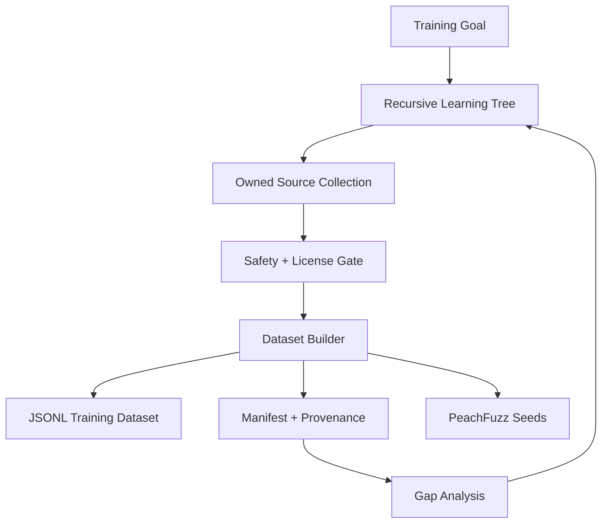

# PeachTree

**PeachTree** is the recursive learning-tree dataset engine for CyberViser / 0AI.

It turns owned repositories, documentation, tests, fuzz reports, issue notes, telemetry summaries, and architecture plans into traceable, safe, deduplicated JSONL datasets for model training and security-assurance workflows.

PeachTree is designed as a shared dependency for:

- [Hancock](https://github.com/0ai-Cyberviser/Hancock) — cybersecurity LLM agent datasets
- [PeachFuzz](https://github.com/0ai-Cyberviser/peachfuzz) — fuzzing findings, crash triage, and regression corpora
- [CyberViser AI](https://cyberviserai.com/) — public project hub and documentation surface
- [0AI](https://0ai-cyberviser.github.io/0ai/) — broader CyberViser / 0AI ecosystem coordination
- [Hancock public docs/demo](https://cyberviser.github.io/Hancock/) — user-facing Hancock project page

## What PeachTree does

PeachTree provides the review-first data layer between raw project material and downstream model/fuzzing workflows.



## Mission

PeachTree helps CyberViser build datasets that are:

- **traceable** — every record keeps source and provenance metadata
- **safe** — secrets, tokens, private keys, and unsafe records are blocked or flagged
- **deduplicated** — deterministic dataset reduction avoids repeated examples
- **reviewable** — plans, manifests, diffs, model cards, and release bundles are generated before publication
- **local-first** — no broad public scraping or automatic training launches by default

## Safety defaults

PeachTree does **not** blindly scrape GitHub.

- local/owned repository ingestion is enabled first
- public GitHub collection is disabled by default
- public collection requires explicit opt-in, license allowlists, rate limits, and provenance
- secret/token/private-key patterns are blocked
- provenance metadata is attached to every record
- generated datasets are ignored by default until reviewed
- trainer handoff commands are dry-run unless explicitly promoted outside PeachTree

## Quick start

```bash
python3 -m venv ~/venvs/peachtree
source ~/venvs/peachtree/bin/activate
python -m pip install -e ".[dev]"

pytest -q

peachtree policy
peachtree plan --goal "Build PeachFuzz training data" --project peachfuzz
peachtree ingest-local --repo . --repo-name peachtree --output data/raw/peachtree.jsonl
peachtree build --source data/raw/peachtree.jsonl --dataset data/datasets/peachtree.jsonl --manifest data/manifests/peachtree.json --domain peachtree
peachtree audit --dataset data/datasets/peachtree.jsonl
```

## Core workflows

### Integrate with PeachFuzz

```bash
peachtree ingest-local --repo ~/peachfuzz --repo-name peachfuzz --output data/raw/peachfuzz.jsonl
peachtree build --source data/raw/peachfuzz.jsonl --dataset data/datasets/peachfuzz-instruct.jsonl --manifest data/manifests/peachfuzz.json --domain peachfuzz
```

Use this path for fuzz harness notes, crash triage reports, minimized reproducers, coverage findings, and safe corpus descriptions.

### Integrate with Hancock

```bash
peachtree ingest-local --repo ~/Hancock --repo-name hancock --output data/raw/hancock.jsonl
peachtree build --source data/raw/hancock.jsonl --dataset data/datasets/hancock-instruct.jsonl --manifest data/manifests/hancock.json --domain hancock
```

Use this path for Hancock modes, API examples, SOC/PICERL triage records, Sigma/YARA examples, CISO summaries, and fuzzing-specialist training records.

### Build from owned GitHub inventory

```bash
peachtree github-owned --owner 0ai-Cyberviser --limit 25 --output data/manifests/owned.jsonl
peachtree github-plan --inventory data/manifests/owned.jsonl
bash scripts/clone_owned_repos.sh
bash scripts/build_owned_datasets.sh
```

The connector inventories access-authorized repositories and generates reviewable scripts. Public GitHub-wide collection remains disabled by default.

## Capability roadmap

| Version | Capability | Status |
|---|---|---|
| v0.1.0 | local recursive dataset engine | Complete |
| v0.2.x | review-first owned GitHub connector | Complete |
| v0.3.0 | dependency graphs and lineage maps | Complete |
| v0.4.0 | ChatML, Alpaca, and ShareGPT exporters | Complete |
| v0.5.0 | scheduled dataset update PR workflow | Complete |
| v0.6.0 | quality scoring, deduplication, readiness checks | Complete |
| v0.7.0 | policy packs, license gates, model-card generation | Complete |
| v0.8.0 | registries, SBOM/provenance, release bundles | Complete |
| v0.9.0 | trainer handoff manifests and LoRA dry-run plans | Complete |

## Dependency graphs and lineage maps

PeachTree v0.3.0 adds local-only graph and lineage reports.

```bash
peachtree graph --inventory data/manifests/owned.jsonl --format mermaid --output reports/ecosystem-graph.mmd
peachtree lineage --dataset data/datasets/peachfuzz-instruct.jsonl --format markdown --output reports/peachfuzz-lineage.md
peachtree ecosystem --inventory data/manifests/owned.jsonl --output reports/ecosystem.json
```

These commands read local inventory, datasets, and manifests. They do not contact GitHub or train models.

## Model exporter profiles

PeachTree v0.4.0 exports reviewed PeachTree datasets into ChatML, Alpaca, and ShareGPT JSONL.

```bash
peachtree export-formats
peachtree export --source data/datasets/peachfuzz-instruct.jsonl --format chatml --output data/exports/peachfuzz-chatml.jsonl
peachtree validate-export --format chatml --path data/exports/peachfuzz-chatml.jsonl
```

Exporters are local-only and preserve provenance metadata by default.

## Scheduled dataset update PR workflow

PeachTree v0.5.0 adds review-first scheduled update tooling.

```bash
peachtree update-plan --repo ~/peachfuzz --repo-name 0ai-Cyberviser/peachfuzz --output data/manifests/update-plan.json
peachtree diff --baseline data/baseline/old.jsonl --candidate data/datasets/new.jsonl --format markdown
peachtree review-report --plan data/manifests/update-plan.json --output reports/update-review.json
```

The included GitHub Actions workflow opens pull requests for dataset updates. It does not train models, upload datasets, or push directly to `main`.

## Dataset quality gates

PeachTree v0.6.0 adds quality scoring, deterministic deduplication, and training readiness checks.

```bash
peachtree score --dataset data/datasets/peachfuzz-instruct.jsonl --markdown-output reports/quality.md
peachtree dedup --source data/datasets/peachfuzz-instruct.jsonl --output data/datasets/peachfuzz-deduped.jsonl
peachtree readiness --dataset data/datasets/peachfuzz-deduped.jsonl --output reports/readiness.json
```

These commands are local-only and do not train models or upload datasets.

## Dataset policy packs

PeachTree v0.7.0 adds policy-pack evaluation, license/compliance gates, and model-card generation.

```bash
peachtree policy-pack --list
peachtree license-gate --dataset data/datasets/peachfuzz-deduped.jsonl --markdown-output reports/license-gate.md
peachtree model-card --dataset data/datasets/peachfuzz-deduped.jsonl --model-name PeachFuzz-Dataset-v1 --output reports/model-card.md
```

These commands are local-only and generate review artifacts before downstream model training.

## Dataset release bundles

PeachTree v0.8.0 adds dataset registries, artifact signing metadata, SBOM/provenance manifests, and release bundle creation.

```bash
peachtree registry data/datasets reports --output reports/registry.json
peachtree sbom --registry reports/registry.json --output reports/sbom.json
peachtree bundle data/datasets/example.jsonl reports/model-card.md --output dist/example-release.zip
```

These commands are local-only and do not train models, upload datasets, or scrape public GitHub.

## Trainer handoff manifests

PeachTree v0.9.0 adds trainer handoff manifests, LoRA job cards, and dry-run training launch plans.

```bash
peachtree handoff --dataset data/exports/example-chatml.jsonl --model-name Example-Lora --base-model mistralai/Mistral-7B-Instruct-v0.3 --output reports/handoff.json
peachtree lora-card --dataset data/exports/example-chatml.jsonl --job-name example-lora --base-model mistralai/Mistral-7B-Instruct-v0.3 --output-dir outputs/example --output reports/lora-job-card.json
peachtree train-plan --job-card reports/lora-job-card.json --output reports/dry-run-training-plan.json
```

These commands are dry-run only and do not launch training.

## Repository creation reference

```bash
git init
git branch -M main
git add .
git commit -m "feat: initial PeachTree recursive dataset engine"
gh repo create 0ai-Cyberviser/PeachTree --public --source=. --remote=origin --push
```
