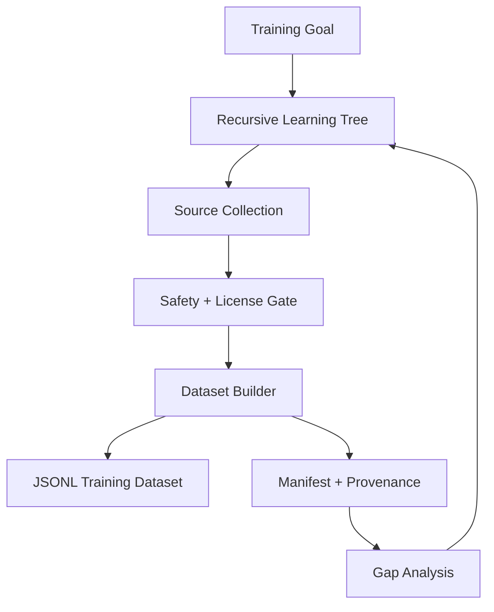

# PeachTree

**PeachTree** is the recursive learning-tree dataset engine for CyberViser / 0AI projects.

It is designed to become a shared dependency for Hancock, PeachFuzz/CactusFuzz, and future 0AI model-training pipelines.

## Mission

PeachTree turns repositories, docs, tests, fuzz reports, issue notes, and architecture plans into traceable, safe, deduplicated JSONL datasets for model training.



## Safety defaults

PeachTree does **not** blindly scrape GitHub.

- local/owned repository ingestion is enabled first
- public GitHub collection is disabled by default
- public collection requires explicit opt-in, license allowlists, rate limits, and provenance
- secret/token/private-key patterns are blocked
- provenance metadata is attached to every record
- generated datasets are ignored by default until reviewed

## Quick start

```bash
python3 -m venv ~/venvs/peachtree
source ~/venvs/peachtree/bin/activate
python -m pip install -e ".[dev]"

pytest -q

peachtree policy
peachtree plan --goal "Build PeachFuzz training data" --project peachfuzz
peachtree ingest-local --repo . --repo-name peachtree --output data/raw/peachtree.jsonl
peachtree build --source data/raw/peachtree.jsonl --dataset data/datasets/peachtree.jsonl --manifest data/manifests/peachtree.json --domain peachtree
peachtree audit --dataset data/datasets/peachtree.jsonl
```

## Create the GitHub repo

```bash
cd ~
unzip PeachTree-v0.1.0.zip
cd PeachTree-v0.1.0

git init
git branch -M main
git add .
git commit -m "feat: initial PeachTree recursive dataset engine"

gh repo create 0ai-Cyberviser/PeachTree --public --source=. --remote=origin --push
```

## Integrate with PeachFuzz

```bash
peachtree ingest-local --repo ~/peachfuzz --repo-name peachfuzz --output data/raw/peachfuzz.jsonl
peachtree build --source data/raw/peachfuzz.jsonl --dataset data/datasets/peachfuzz-instruct.jsonl --manifest data/manifests/peachfuzz.json --domain peachfuzz
```

## Integrate with Hancock

```bash
peachtree ingest-local --repo ~/Hancock --repo-name hancock --output data/raw/hancock.jsonl
peachtree build --source data/raw/hancock.jsonl --dataset data/datasets/hancock-instruct.jsonl --manifest data/manifests/hancock.json --domain hancock
```

## Roadmap

- v0.1.0: local recursive dataset engine
- v0.2.0: safe GitHub connector for owned repos
- v0.3.0: dependency graph across Hancock, PeachFuzz, PeachTree
- v0.4.0: model exporter profiles for ChatML, Alpaca, ShareGPT
- v0.5.0: CI scheduled dataset update PRs
