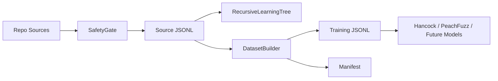

# PeachTree Architecture

```mermaid
flowchart LR
    A[Repo Sources] --> B[SafetyGate]
    B --> C[Source JSONL]
    C --> D[RecursiveLearningTree]
    C --> E[DatasetBuilder]
    E --> F[Training JSONL]
    E --> G[Manifest]
    F --> H[Hancock / PeachFuzz / Future Models]
```
