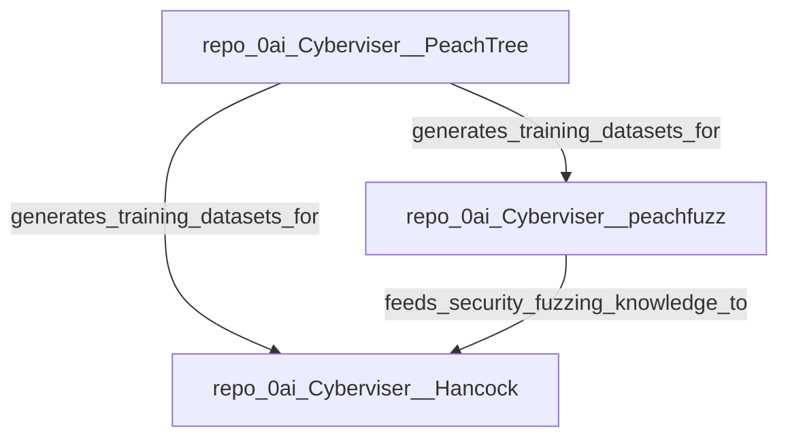

# Cross-Repo Dependency Graphs and Dataset Lineage Maps

PeachTree v0.3.0 adds local-only graph and lineage tooling.

## Commands

Build an ecosystem dependency graph:

```bash
peachtree graph \
  --inventory data/manifests/owned.jsonl \
  --dataset-dir data/datasets \
  --manifest-dir data/manifests \
  --format mermaid \
  --output reports/ecosystem-graph.mmd
```

Build lineage for one dataset:

```bash
peachtree lineage \
  --dataset data/datasets/0ai-Cyberviser__peachfuzz-instruct.jsonl \
  --manifest data/manifests/0ai-Cyberviser__peachfuzz.json \
  --format markdown \
  --output reports/peachfuzz-lineage.md
```

Build a combined ecosystem report:

```bash
peachtree ecosystem \
  --inventory data/manifests/owned.jsonl \
  --dataset-dir data/datasets \
  --manifest-dir data/manifests \
  --output reports/ecosystem.json
```

## Safety model

This feature is local-only. It does not clone repositories, call GitHub, scrape public code, run shells, or train models. It reads already-generated inventory, datasets, and manifests.

## Mermaid example



## Dataset lineage

Lineage maps show:

- source repository
- source path
- source digest
- generated record IDs
- record counts per file
- manifest metadata

Use this before model training to review provenance and remove unsuitable sources.
