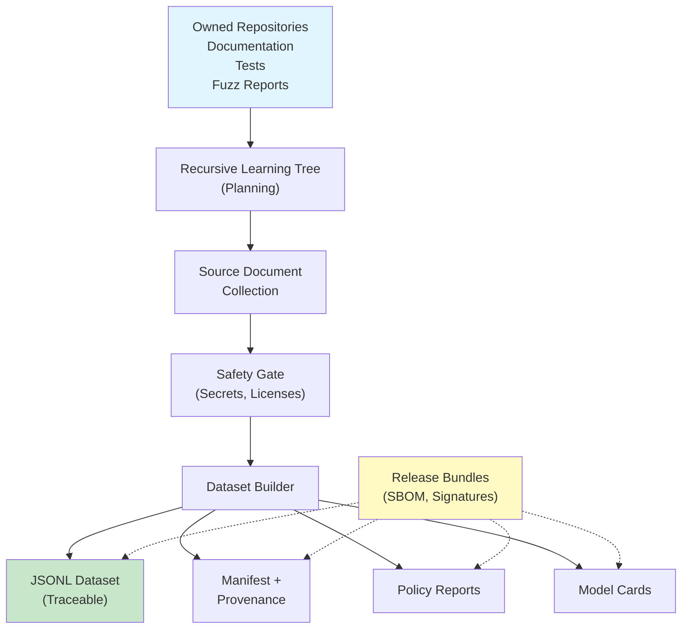

# Overview

PeachTree is a production dataset control plane that sits between raw project material and machine learning training workflows.

## Why PeachTree?

Building safe, traceable ML datasets is hard:

- **Raw data sprawl**: Source material spread across repositories, docs, tests, fuzz reports
- **Safety risks**: Hardcoded secrets, unknown licenses, unsafe content
- **Reproducibility**: Hard to audit what data went into a model
- **Scale**: Manual review doesn't scale to thousands of records
- **Compliance**: Need governance, approvals, and compliance proof

PeachTree solves these problems with an automated, reviewable, provenance-first approach.

## Core Philosophy

### Local-First
- Owned repositories ingested by default
- Public collection requires explicit opt-in and policies
- No automatic GitHub scraping

### Review-First
- Plans, diffs, and manifests generated before publication
- Human approval required before training launches
- Transparent policy evaluation

### Provenance-Driven
- Every record tracks source, path, commit, and digest
- SBOM and signatures for supply chain verification
- Audit trail for compliance

### Safe by Default
- Secrets filtered automatically
- License compliance enforced
- Content safety checks applied
- Low-quality records excluded

## Use Cases

### 1. Secure Model Training

Prepare safe, auditable datasets for LLM fine-tuning:

```
Your Repositories → PeachTree → Training JSONL + Model Card → Hancock LLM
```

### 2. Fuzzing Infrastructure

Build regression and seed corpora from past findings:

```
Fuzzing Crashes → PeachTree → Corpus + Metadata → PeachFuzz
```

### 3. Security Assurance

Verify training data compliance for enterprise models:

```
Raw Data → PeachTree Safety Gates → Policy Compliance Report → Audit
```

### 4. Dataset Release

Package datasets with provenance and signatures for public release:

```
Dataset → PeachTree Bundle → SBOM + Signatures → Distribution
```

## Architecture at a Glance



## Key Components

### RecursiveLearningTree
Hierarchical planning system that explores learning objectives through branching strategies.

**Example**: Building a security-focused dataset might branch into:
- CVE documentation collection
- Security blog posts
- Code review comments
- Test cases for security functions

### SafetyGate
Multi-layer filtering system preventing:
- Hardcoded API keys, passwords, tokens
- Incompatible licenses
- Unsafe or offensive content
- Duplicate records

### DatasetBuilder
Converts raw documents into deterministic JSONL records with full provenance.

Each record includes:
```json
{
  "id": "sha256-<digest>",
  "text": "content",
  "source_repo": "owner/repo",
  "source_path": "path/to/file",
  "source_digest": "commit-hash",
  "license": "MIT",
  "quality_score": 0.92
}
```

### Policy Packs
Composable safety and quality policies:
- **commercial-ready**: Enterprise compliance
- **open-safe**: Public license friendly
- **internal-review**: Requires human approval
- Custom policies

## Workflow

### 1. Plan
Define learning objectives and data collection strategy:
```bash
peachtree plan --repositories src/ --objective "build training dataset"
```

### 2. Ingest
Collect source documents from owned repositories:
```bash
peachtree ingest-local src/ --output sources.jsonl
```

### 3. Build
Apply safety gates and create training dataset:
```bash
peachtree build sources.jsonl --output dataset.jsonl --filter-secrets
```

### 4. Validate
Audit, score, and deduplicate:
```bash
peachtree audit dataset.jsonl
peachtree quality dataset.jsonl
peachtree dedup dataset.jsonl
```

### 5. Review
Generate model cards and diff reports:
```bash
peachtree diff dataset.jsonl --previous-version old.jsonl
peachtree model-card dataset.jsonl
```

### 6. Release
Create signed, verifiable release bundles:
```bash
peachtree bundle dataset.jsonl --sign
```

### 7. Train
Hand off to downstream workflows (Hancock, PeachFuzz, etc.):
```bash
peachtree handoff dataset.jsonl --workflow hancock
```

## Getting Started

- [Installation](installation.md)
- [Quick Start (5 min)](quickstart.md)
- [Full CLI Reference](../user-guide/cli.md)
- [Architecture Details](../architecture/design.md)

## Integration

PeachTree integrates with:
- **Hancock**: Cybersecurity LLM agent
- **PeachFuzz**: Fuzzing infrastructure
- **CyberViser AI**: Documentation hub
- **0AI Ecosystem**: Broader coordination

## Next Steps

1. [Install PeachTree](installation.md)
2. [Run Quick Start](quickstart.md)
3. [Learn CLI Commands](../user-guide/cli.md)
4. [Understand Architecture](../architecture/design.md)
5. [Explore Advanced Features](../advanced/policy-compliance.md)
